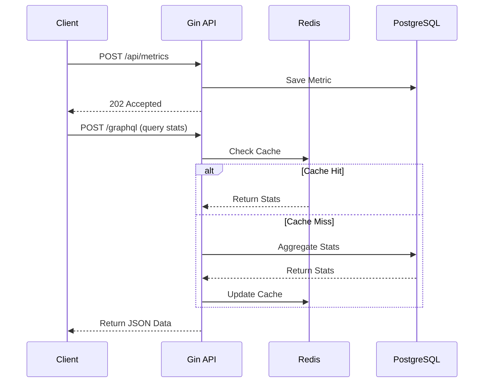
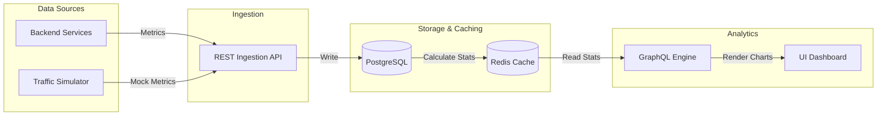
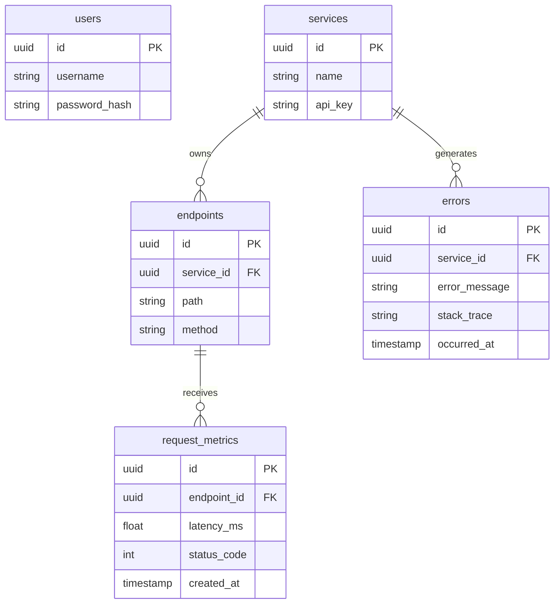

# GoPulse — API Observability & Performance Platform

GoPulse is a production-grade backend platform designed to collect, process, store, and expose API observability data. It provides developers and teams with deep insights into the health and performance of their APIs.

## 1. Project Overview

GoPulse acts as a centralized observability system where backend services can send telemetry (request latency, status codes, errors). It processes these metrics, stores them efficiently, caches aggregations, and serves insights via a GraphQL API.

## 2. Problem Statement

Modern microservices require visibility into their API traffic. Developers need to know:
- Which endpoints are the slowest?
- What is the error rate for a specific service?
- Are we meeting our latency SLAs (p95, p99)?

GoPulse provides the missing observability layer.

## 3. Key Features

- **High-throughput metric ingestion** via REST APIs.
- **Real-time analytics** exposed via a flexible GraphQL interface.
- **Robust data storage** with PostgreSQL.
- **High-performance caching** using Redis.
- **Graceful degradation**: functions even if the cache layer fails.
- **Centralized error tracking** with stack traces.

## 4. Tech Stack

- **Go**: Core backend service.
- **Gin**: REST API router and middleware.
- **GraphQL (gqlgen)**: Flexible analytics query layer.
- **PostgreSQL**: Relational storage for metrics and configuration.
- **Redis**: Caching layer for fast analytics retrieval.
- **Docker & Docker Compose**: Containerization and local infrastructure.

## 5. Architecture

GoPulse follows a clean architecture pattern separating concerns into handlers, middleware, services, and repositories.

## 6. System Architecture Diagram

```mermaid
flowchart TD
    subgraph Frontend [Interactive Dashboard]
        UI[Glassmorphic UI (HTML/JS)]
        Chart[Chart.js Visualizations]
        Traffic[Traffic Simulator]
        UI --> Chart
        UI --> Traffic
    end

    subgraph Backend [GoPulse Core Application]
        Gin[Gin HTTP Router]
        Middleware[Middleware Layer\n(Auth, Logging, Request ID)]
        REST[REST Handlers\n(Ingestion & Provisioning)]
        GQL[GraphQL Handlers\n(Analytics & Data Fetch)]
        Service[Service Layer\n(Business Logic)]
        Repo[Repository Layer\n(Data Access)]
        
        Gin --> Middleware
        Middleware --> REST
        Middleware --> GQL
        
        REST --> Service
        GQL --> Service
        Service --> Repo
    end

    subgraph Infrastructure [Data Layer]
        Postgres[(PostgreSQL\nRelational Data)]
        Redis[(Redis\nLook-aside Cache)]
    end

    %% Connections
    Traffic -- "POST /api/metrics\n(High Throughput)" --> Gin
    UI -- "POST /graphql\n(Complex Queries)" --> Gin
    Repo -- "sqlx (Connection Pool)" --> Postgres
    Repo -- "go-redis" --> Redis
```

## 7. Request Lifecycle Diagram



## 8. Data Flow Diagram



## 9. Database Architecture (Entity Relationship)

The schema is normalized for high performance:



- `users`: Dashboard authentication.
- `services`: Target APIs being monitored (requires API Keys).
- `endpoints`: Automatically discovered paths.
- `request_metrics`: High-volume table for request latency and status.
- `errors`: High-volume table for application errors.

## 10. Redis Caching Flow

We use Redis as a look-aside cache. Aggregations (like error rates or latency averages for the last hour) are cached with short TTLs (e.g., 5 minutes) to protect PostgreSQL from analytical queries. If Redis is unavailable, the application falls back to PostgreSQL querying.

## 11. REST API Architecture

- `POST /api/metrics`: Ingest metric data.
- `POST /api/services`: Register a new service.
- `GET /api/services`: List monitored services.
- `GET /health` & `GET /ready`: Kubernetes-friendly probes.

## 12. GraphQL Architecture

GraphQL is implemented using `gqlgen`. Resolvers fetch data from the service layer, which abstracts the underlying DB and cache implementations.

## 13. Authentication Flow

- **Dashboard Auth**: JWT-based login (can be added easily in `auth.go`).
- **Agent Auth**: API Keys passed via `X-API-Key` headers for ingestion APIs.

## 14. Error-Handling Flow

Errors are converted to standard `AppError` types in the service/repository layers, which are caught by the `ErrorHandlerMiddleware` to return consistent JSON structures to the client.

## 15. Observability Workflow

GoPulse is observable itself! We use `go.uber.org/zap` for high-performance structured JSON logging, injecting the `X-Request-ID` into every log line.

## 16. Docker Architecture

We use multi-stage Docker builds for small, secure Go binaries (Alpine). `docker-compose.yml` orchestrates PostgreSQL, Redis, and the Go App.

## 17. Project Directory Structure

```text
gopulse/
├── cmd/server/          # Main application entrypoint
├── internal/
│   ├── config/          # Environment configuration
│   ├── handlers/        # Gin REST and GraphQL HTTP handlers
│   ├── middleware/      # Auth, logging, recovery
│   ├── services/        # Business logic
│   ├── repositories/    # Database interaction (sqlx)
│   ├── models/          # Data structures
│   ├── graphql/         # Generated GraphQL resolvers
│   ├── cache/           # Redis implementation
│   ├── database/        # Postgres connection pooling
│   ├── logger/          # Zap logger setup
│   └── errors/          # Custom application errors
├── migrations/          # SQL files for schema
├── Dockerfile           # Multi-stage build
├── docker-compose.yml   # Local dev environment
└── frontend/            # Static UI dashboard (HTML, CSS, JS)
```

## 18. Interactive Frontend Dashboard

GoPulse includes a sleek, glassmorphic UI served directly by the Go backend at `/dashboard`.

- **No frontend frameworks**: Built with Vanilla HTML/JS and Chart.js for speed.
- **Traffic Simulation**: Test ingestion with the built-in load generator.
- **Live Graphing**: Automatically queries the GraphQL API to render latency and error rate charts.

## 19. Local Setup

1. Copy `.env.example` to `.env`.
2. Ensure you have Go 1.22+ installed.
3. Start dependencies: `docker compose up -d postgres redis`
4. Run migrations: `make migrate-up`
5. Start server: `make run`

## 20. Docker Setup

To run everything in Docker:
```bash
docker compose up --build
```

## 21. Future Improvements
- Add asynchronous metric processing via Kafka/RabbitMQ.
- Add timeseries optimization to PostgreSQL (e.g., TimescaleDB).
- Add support for exporting metrics to Prometheus.
